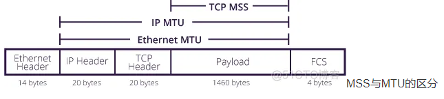
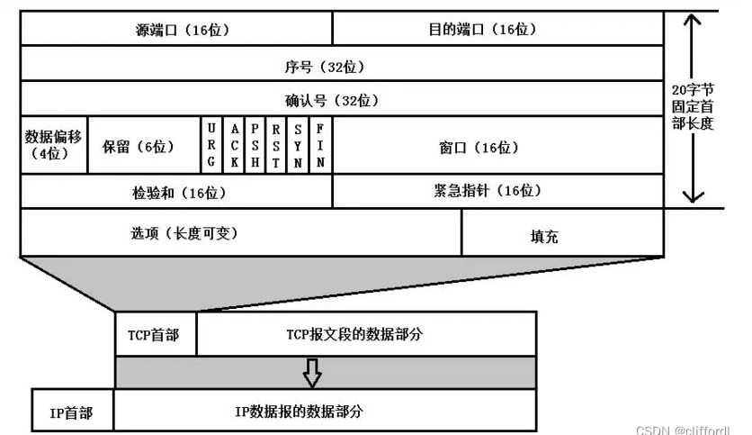

# 计算机网络基础篇

## OSI标准模型

应用层，表示层，会话层，传输层，网络层，数据链路层，物理层

## 原理体系结构

应用层，运输层，网络层，数据链路层，物理层

### TCP/IP系结构剖析

#### 应用层

##### 描述

在计算机网络体系中处于最上层，我们手机或电脑使用的应用软件都在应用层实现，应用层只关注于为用户提供应用功能（体现了设计模式中的-单一职责原则SRP）,应用层是工作在操作系统中的用户态，传输层以及一下是工作在内核态

#### 传输层

##### 描述

传输层是为应用层提供网络支持的。

传输层有两个协议，分别为**TCP**和**UDP**。

##### TCP

全称:传输层控制协议，可靠，大部分应用使用的就是TCP传输层协议，比如HTTP应用层协议使用的就是TCP传输层协议。

##### UDP

不可靠，传输效率高。

##### 传输层数据分段

应用如果传输的数据非常大。如果直接传输，会不好控制，当传输层接收到应用层的数据超过**MSS**（TCP最大报文长度）时，传输层会将数据进行分段，他的作用是：在传输途中如果有一段数据包丢了，只需要重传这一个分段，而不是将整个数据包重传。这样一个数据包段称为**TCP段**

##### 端口

为什么会有端口概念？

当设备作为接收方时，传输层要将数据包传输给这台设备的某个应用，但是一个设备是很可能会有多个应用的，这些应用都会接收或者传输数据，我们要将设备中的这些应用区分开来，将数据包发送到一个指定应用，就需要用**端口**进行应用间的区分。

#### 网络层

###### 描述

网络层是的主要任务是实现网络之间的互联，进而实现数据包在各个网络之间的传输，但是她并不负责数据的传输任务（并不违背设计原则）

###### IP协议

网络层最常用的就是IP协议，IP协议会将传输层的数据包作为IP协议的数据部分，再加上IP包头组成**IP报文**（类似于设计模式中的**装饰模式**，将传输层的数据包进行装饰后再传递给下一层）。

IP报文的大小超过限制也会进行分段（二次分段，传输层进行第一次分段），IP报文长度超过了MTU（以太网中一般为1500字节）时会触发分段

##### 寻址和路由

我们一般用IP地址给设备进行编号，对于IPV4协议，IP地址共32位，分成4段，每段8位。但是，只有一个IP地址，虽做到了设备区分，但是设备量太大，寻址起来太麻烦，因此需要将IP地址分为两种含义:网络号和主机号。

###### 网络号

负责标识该IP是属于那个子网的

###### 主机号

负责标识同一子网下的不同主机

配合**子网掩码**计算出IP地址的网络号和主机号，在寻址过程中，先匹配到对应的网络号再匹配到对应网络号下的主机。除了寻址能力，IP协议还有一个重要的能力就是**路由**。IP协议的**寻址**是告诉我们去下一个目的地该怎么走，**路由**则是根据【下一个目的地】选择路径，寻址是导航，路由是操作的方向盘。

#### 数据链路层

一个用于标识网络中的设备，让数据在一个链路中传输的层级，就是**数据链路层**，它主要是为网络层提供链路级别传输的服务。

 每一台设备的网卡都会有一个**MAC地址**,它就是用来唯一标识设备的。路由器计算出了下一个目的的IP地址，再通过ARP协议找到该目的MAC地址，这样就知道这个IP地址是那个设备的了。

链路：从一个节点到另一个节点的一段物理线路，并且中间不存在任何的其他节点

数据链路：把实现通信协议的硬件和软件加到链路上，就构成了数据链路。数据链路层以帧为单位传输和处理数据

#### 物理层

数据准备从设备发送到网络时，需要把数据包转换成电信号，让其可以在物理媒介中传输，这一层就是**物理层**，它主要是为**数据链路层**提供二进制传输服务。

物理层主要考虑的是怎样在连接各种计算机的传输媒体上传输数据比特流、

## 计算器网络之HTTP

我们在浏览器输入网址后可以访问网站内容，这就是**万维网WWW应用**，其相关的应用层协议为**超文本传输协议HTTP** -- **应用层协议**

### HTTP基本概念

http是超文本传输协议，英文全称：**H**yper**T**ext **T**ransfer **P**rotocal

- 超文本 -- 超越了普通文本的本本，文字，图片，视频。

- 传输 -- http是一个两点之间传输数据的双向协议。

- 协议 -- 两个以上参与者的行为约定和规范。

**HTTP是一个在计算机世界里专门在 【两点】之间 【传输】文字，图片，音频，视频等【超文本】 数据的【约定和规范】**

### HTTP请求响应过程（待补充，后面按自己理解更详细补充）

### HTTP请求特征

简单，灵活，易于扩展，应用广泛，跨平台。

### 持久性连接，非持久性连接

HTTP1.0:  非持久性连接，每次http的请求响应过程，都需要建立一个新的TCP连接。

HTTP1.1：持久性连接。

#### 非持久性的缺点

1. 必须为每个http请求的对象建立和维护一个全新的连接。

2. 对于每个连接，在客户端和服务端都需要为TCP分配一个缓冲区和保持TCP变量，这会给web服务器带来巨大压力，每一台服务器服务会同时维护数百上千的请求。

#### 持久性连接的特点

只要任意一端没有提出断开连接，则会保持TCP连接状态。

### HTTP报文格式

##### 组成部分

- 起始行

- 头部字段

- 消息正文 -- 使用GET方法是没有消息正 文的，POST方法才会有实体
  
  

## 计算机网络之TCP

### 什么是TCP

- ###### 面向连接：TCP只能一对一连接，不能一对多（UDP才能一对多）

- ###### 可靠的:  TCP能保证发送端的每一个报文都能到达接收端

- ###### 字节流: 消息是没有边界的，无论多大都可以进行传输。消息也是【有序】的，当发送端的前一个消息在接收端还没收到时，即使它已经收到了后面的消息，接收端也还不能吧这个报文数据交给应用处理，接收端会先对数据进行去重，并且保证数据有序性和完整性。

TCP连接是全双工服务，指的是，如果存在一条TCP连接，那么双方都可以互相发送接收数据。
TCP会将数据临时存放到缓冲区，**发送缓冲区**，**接收缓冲区**。
TCP会将需要传输的数据分为多个TCP段俗称报文段（TCP头+TCP数据），每一个TCP报文段的传输长度是有限的，他的最大长度为**MSS--最大报文段长度**（不包含TCP头部信息）。在TCP报文段向下传输的过程中，会经过网络层，网络层有一个**最大传输单元--MTU**，**MTU=MSS+IP HEARD(头部固定长度为20)+TCP HEARD（头部固定长度为20)** 他们的区别如下

### MSS和MTU的区别

| S.NO | MSS                                     | MTU                                       |
| ---- | --------------------------------------- | ----------------------------------------- |
| 1.   | MSS表示最大TCP段大小。                          | MTU表示最大传输单元协议。                            |
| 2.   | MSS对TCP报头使用三次握手协议。                      | MTU没有对TCP报头使用握手协议。                        |
| 3.   | 相对于MTU协议的较低值，MSS不需要对数据包进行分片。            | 相对于MTU协议的较低值，MSS对数据报文进行分片处理。              |
| 4.   | 它计算并确定发生在TCP协议的每一层传输和隧道模式的分段的数量。        | 它不确定每一层TCP协议中的分段数量。                       |
| 5.   | 它不具备任何跨网络路由器的数据传输能力。                    | 它决定了网络网关能够从一个路由器终端传输到另一个路由器终端的最大数据字节量的能力。 |
| 6.   | 它使用TCP/IP的第四层协议。                        | 它使用TCP/IP的第二层协议。                          |
| 7.   | 它决定了用于传输的数据块载荷的最大大小。                    | 它决定了在两个网络路由器之间传输的最大数据量。                   |
| 8.   | MSS = MTU – 40 (IP header + TCP header) | MTU = MSS + 40 (IP header + TCP header)   |

 

### 为什么MSS（最大报文段长度-不包含TCP头部）的值不超过1460字节

在网络传输数据时，数据会交付给下游的数据链路层的，而数据链路层的传输基本单位为‘帧’。**二型以太网**规定，帧的大小不能超过1518字节（**14字节的帧头+4字节的帧校验和+最多1500字节数据**）。所以IP数据包的大小如果超过了1500字节，那么在链路层，就要对这个IP数据包进行分片处理，这种分片显然时不利的，有一定的开销，为了避免这个问题，我们希望IP包（段）的大小不能超过1500字节，除去IP段头数据（20字节），又要除去TCP段头部数据（20字节），**也就是TCP携带的数据，不能超过1460字节**，这就是为什么MSS的最大值为1460字节的原因。如图：

### TCP头部格式

#### TCP 端口号

TCP的连接是需要四个要素确定连接唯一：
（源IP，源端口号）+ （目地IP，目的端口号）
所以TCP首部预留了两个16位作为端口号的存储，而IP地址由上一层IP协议负责传递
源端口号和目地端口各占16位两个字节，也就是端口的范围是2^16=65535
另外1024以下端口是系统保留的，从1024-65535是用户使用的端口范围。
synrcvd

#### TCP 的序号和确认号

32位序号 seq：Sequence number 缩写seq ，TCP通信过程中某一个传输方向上的字节流的每个字节的序号，通过这个来确认发送的数据有序，也可以理解为：本次传输数据的起始字节在整个数据流中的位置。比如现在序列号为1000，发送了1000，下一个序列号就是2000。
32位确认号 ack：Acknowledge number 缩写ack，TCP对上一次seq序号做出的确认号，用来响应TCP报文段，给收到的TCP报文段的序号seq加1。也可以理解为： 期望收到下一包的序号，用于确认已经收到数据的偏移序号。

#### 数据偏移（4位首部长度）

占4位，它指出TCP报文段的数据起始处距离TCP报文段的起始处有多远。这个字段指出TCP报文段的首部长度（报头长度）。由于首部中还有长度不确定的选项字段，因此数据偏移字段是必要的，注意，**“数据偏移”的单位不是位，而是4字节**。由于4位二进制数能表示的最大十进制数字是15，因此数据偏移的最大值是60字节（15*4字节），这也是TCP首部的最大字节（即选项长度不能超过40字节=60-20）。

首部长度（报头长度） - 20字节 = 选项长度 如果数据偏移的值是5，此时表示整个TCP报头的长度是 4\*5 = 20字节(此时相当于没有选项) 如果数据偏移的值是15，此时表示整个TCP报头的长度是4*15 = 60字节(此时相当于选项是40个字节) 、

#### 保留

填充为0

#### TCP 的标志位

6位标志位，它们中的多个可同时被设置为1。每个TCP段都有一个目的，这是借助于TCP标志位选项来确定的，允许发送方或接收方指定哪些标志应该被使用，以便段被另一端正确处理。
用的最广泛的标志是 SYN，ACK 和 FIN，用于建立连接，确认成功的段传输，最后终止连接。

1. URG：简写为U，紧急标志位，表示数据包的紧急指针域有效，用来保证连接不被阻断，并督促中间设备尽快处理；
   
   

2. ACK：简写为.，确认标志位，对已接收的数据包进行确认；

3. PSH：简写为P，推送标志位，表示该数据包被对方接收后应立即交给上层应用，而不在缓冲区排队；

4. RST：简写为R，重置标志位，用于连接复位、拒绝错误和非法的数据包；

5. SYN：简写为S，同步标志位，用于建立会话连接，同步序列号；

6. FIN： 简写为F，完成标志位，表示我已经没有数据要发送了，即将关闭连接；

##### 紧急 URG

当URG=1时，表明紧急指针字段有效。它告诉系统此报文段中有紧急数据，应尽快发送（相当于高优先级的数据），而不要按原来的排队顺序来传送。例如，已经发送了很长的一个程序要在远地的主机上运行。但后来发现了一些问题，需要取消该程序的运行，因此用户从键盘发出中断命令。如果不使用紧急数据，那么这两个字符将存储在接收TCP的缓存末尾。只有在所有的数据被处理完毕后这两个字符才被交付接收方的应用进程。这样做就浪费了很多时间。当URG置为1时，发送应用进程就告诉发送方的TCP有紧急数据要传送。于是发送方TCP就把紧急数据插入到本报文段数据的最前面，而在紧急数据后面的数据仍然是普通数据。这时要与首部中紧急指针（Urgent Pointer）字段配合使用。

##### 确认 ACK

仅当 ACK = 1时确认号字段才有效，当 ACK = 0时确认号无效。TCP 规定，在连接建立后所有的传送的报文段都必须把 ACK 置为1。

##### 推送 PSH

当两个应用进程进行交互式的通信时，有时在一端的应用进程希望在键入一个命令后立即就能收到对方的响应。在这种情况下，TCP 就可以使用推送（push）操作。这时，发送方 TCP 把 PSH 置为1，并立即创建一个报文段发送出去。接收方 TCP 收到 PSH =1的报文段，就尽快地（即“推送”向前）交付接收应用进程。而不用再等到整个缓存都填满了后再向上交付。一般这个不需要手动执标志，TCP 默认实现。

##### 复位 RST

当 RST = 1时，表名 TCP 连接中出现了严重错误（如由于主机崩溃或其他原因），必须释放连接，然后再重新建立传输连接。RST 置为1还用来拒绝一个非法的报文段或拒绝打开一个连接。

##### 同步 SYN

在连接建立时用来同步序号。当 SYN = 1而 ACK = 0时，表明这是一个连接请求报文段。对方若同意建立连接，则应在响应的报文段中使 SYN = 1和 ACK = 1，因此 SYN 置为1就表示这是一个连接请求或连接接受报文。

终止 FIN

发送端完成任务，表要求释放运输连接。

### TCP和UDP的区别

| **类型** | **面向连接** | **传输可靠性** | **传输速率** | **所需资源** | **应用场景**           | **首部长度** |
| ------ | -------- | --------- | -------- | -------- | ------------------ | -------- |
| TCP    | 面向连接     | 可靠        | 慢        | 多        | 要求数据传输可靠（如文件、邮件传输） | 20~60字节  |
| UDP    | 无连接      | 不保证可靠     | 快        | 少        | 要求通信速度快（如视频，音频）    | 8字节      |

### TCP的三次握手和四次挥手

#### TCP三次握手流程

●SYN（Synchronize Sequence Numbers），同步序列编号；

●ACK（Acknowledge Character），确认字符；

●SEQ（Sequence Number），序列号。

最开始,客户端和服务端都处于CLOSE状态。在通信开始前,双方都要创建自己的**传输控制块(TCB)**,服务端创建完TCB后,会立即进入LISTEN状态,监听客户端发来的连接请求

###### 第一次握手

客户端向服务端发送连接请求报文,请求发送后,客户端便会进入**SYN-SENT(同步发送状态)**。

###### 第二次握手

服务端接收到客户端的连接请求,如果同意连接,则会发送一个ACK应答报文,此时服务端进入**SYN-RCVD(同步接收状态)**。

###### 第三次握手

客户端收到服务端的连接同意应答后,还需要向服务端发送一个确认报文段,客户端发送了这个确认应答报文后会进入**连接建立状态**,服务端接收到这个确认应答报文后也会进入**连接建立状态**。 三次握手结束

#### TCP为什么要三次握手？不是两次也不是四次？

[TCP为什么三次握手?](https://mp.weixin.qq.com/s?__biz=MzU0OTE4MzYzMw==&mid=2247520638&idx=5&sn=aaf6970805bb6ad231f5969524c668d4&chksm=fbb11880ccc691969585ac8bdaeabe9b2966ecc9019e2247008a7f613e3a513c313842a71c53&scene=27)

###### 防止重复历史连接的初始化

1. 假设现有一个TCP请求,第一次(T1)发送由于超时,TCP进行超时重传,发送了第二次请求(T2)。
   如果建立连接只需要两次握手,对于客户端来说没有什么影响,仍旧是获取服务端ACK后才会进入  **ESTABLISHED(连接建立状态)**,但是对于服务端来说,当T2请求进行两次握手建立连接并且通信完成释放连接后,T1到达了服务端,此时,由于是两次握手,服务端会直接进入 **ESTABLISHED(连接建立状态)**,等待发送数据或主动发送数据,但是此时客户端早已进入了**CLOSE(连接关闭状态)**,服务端会一直等待下去,这样会**浪费服务端的连接资源**

2. 如果是三次连接的话，客户端会再接收到服务端的SEQ+1后，会判断当前连接是否为历史连接，如果是历史连接，客户端会发送**终止报文（RST）**，如果不是历史连接，就会发送ACK指令和服务端建立连接。**再两次握手的情况下，服务端没有一个中间状态来给客户端阻止历史连接，导致服务端可能建立一个新连接，造成资源的浪费**

###### 同步双方初始序列号

TCP协议通信的双方，都必须要维护一个【序列号】，序列号是TCP可靠通信的关键，它可以：去重，保证数据的顺序，了解哪些已被接收

所以当客户端发送携带【初始序列号】的SYN报文给服务端的时候，服务端会应答一个ACK报文给客户端，代表着客户端的初始SYN报文服务端已经接收到，那么客户端接收到服务端携带了【初始序列号】的报文时，也需要给服务端一个应答，这样才能保证双方的初始序列号才能被可靠的同步。

###### 确认客户端和服务端收发能力正常

三次握手的主要作用就是为了确定双方的接收和发送能力是否正常并指定自己的初始序列号为后面的可靠传输做准备。实质上就是连接服务端指定端口，建立TCP连接，并同步双方的序列号和确认号，交换双方的TCP窗口大小信息。

如果是两次握手，客户端是能确定双方的接收和发送能力正常，但是服务端是不知道客户端的接收能力是否正常，所以TCP建立连接至少需要三次握手才能确定最重要的这一点。

###### 为什么不是四次握手？

三次握手就是理论上能保证双方通信可靠信的建立连接的最少次数了，所以没必要进行第四次握手。

#### TCP四次挥手流程

1. 客户端进程发出连接释放报文，并且停止发送数据。释放数据报文首部，FIN=1，其序列号为seq=u（等于前面已经传送过来的数据的最后一个字节的序号加1），此时，客户端进入FIN-WAIT-1（终止等待1）状态。 TCP规定，FIN报文段即使不携带数据，也要消耗一个序号。

2. 服务器收到连接释放报文，发出确认报文，ACK=1，ack=u+1，并且带上自己的序列号seq=v，此时，服务端就进入了CLOSE-WAIT（关闭等待）状态。TCP服务器通知高层的应用进程，客户端向服务器的方向就释放了，这时候处于半关闭状态，即客户端已经没有数据要发送了，但是服务器若发送数据，客户端依然要接受。这个状态还要持续一段时间，也就是整个CLOSE-WAIT状态持续的时间。

3. 客户端收到服务器的确认请求后，此时，客户端就进入FIN-WAIT-2（终止等待2）状态，等待服务器发送连接释放报文（在这之前还需要接受服务器发送的最后的数据）。

4. 服务器将最后的数据发送完毕后，就向客户端发送连接释放报文，FIN=1，ack=u+1，由于在半关闭状态，服务器很可能又发送了一些数据，假定此时的序列号为seq=w，此时，服务器就进入了LAST-ACK（最后确认）状态，等待客户端的确认。

5. 客户端收到服务器的连接释放报文后，必须发出确认，ACK=1，ack=w+1，而自己的序列号是seq=u+1，此时，客户端就进入了TIME-WAIT（时间等待）状态。注意此时TCP连接还没有释放，必须经过2∗∗MSL（最长报文段寿命）的时间后，当客户端撤销相应的TCB后，才进入CLOSED状态。

6. 服务器只要收到了客户端发出的确认，立即进入CLOSED状态。同样，撤销TCB后，就结束了这次的TCP连接。可以看到，服务器结束TCP连接的时间要比客户端早一些。

#### TCP为什么要四次挥手？

当客户端主动发起关闭连接时，客户端会发送一个FIN告诉服务端我要断开连接了，此时的客户端仅仅只是不会向服务端发送数据，客户端还是能接收到数据的，当服务端收到FIN时，会向客户端发送一个ACK，告诉客户端我收到你的中断请求了，但是服务端可能还有一些数据没有处理完，还需要向客户端发送数据，当服务端处理完这些数据时，服务端也会向客户端发送一个FIN来标识同意关闭此次连接，这就是为什么要四次挥手的原因。

#### 为什么客户端在TIME-WAIT阶段要等2MSL？

为的是确认服务器端是否收到客户端发出的 ACK 确认报文，当客户端发出最后的 ACK 确认报文时，并不能确定服务器端能够收到该段报文。

所以客户端在发送完 ACK 确认报文之后，会设置一个时长为 2MSL 的计时器。

MSL 指的是 Maximum Segment Lifetime：一段 TCP 报文在传输过程中的最大生命周期。

2MSL 即是服务器端发出为 FIN 报文和客户端发出的 ACK 确认报文所能保持有效的最大时长。

服务器端在 1MSL 内没有收到客户端发出的 ACK 确认报文，就会再次向客户端发出 FIN 报文：

- 如果客户端在 2MSL 内，再次收到了来自服务器端的 FIN 报文，说明服务器端由于各种原因没有接收到客户端发出的 ACK 确认报文。客户端再次向服务器端发出 ACK 确认报文，计时器重置，重新开始 2MSL 的计时。

- 否则客户端在 2MSL 内没有再次收到来自服务器端的 FIN 报文，说明服务器端正常接收了 ACK 确认报文，客户端可以进入 CLOSED 阶段，完成“四次挥手”。

所以，客户端要经历时长为 2SML 的 TIME-WAIT 阶段;这也是为什么客户端比服务器端晚进入 CLOSED 阶段的原因。

> 这里特别需要主要的就是TIME_WAIT这个状态了，这个是面试的高频考点，就是要理解，为什么客户端发送 ACK 之后不直接关闭，而是要等一阵子才关闭。这其中的原因就是，要确保服务器是否已经收到了我们的 ACK 报文，如果没有收到的话，服务器会重新发 FIN 报文给客户端，客户端再次收到 ACK 报文之后，就知道之前的 ACK 报文丢失了，然后再次发送 ACK 报文。
> 至于 TIME_WAIT 持续的时间至少是一个报文的来回时间。一般会设置一个计时，如果过了这个计时没有再次收到 FIN 报文，则代表对方成功就是 ACK 报文，此时处于 CLOSED 状态。

### TCP可靠性传输

TCP是通过序列号，确认应答号，重传控制，连接管理以窗口控制等机制来实现可靠新传输的。

#### 校验和（校验和的算法比较难懂，先描述，不讲原理）

发送方：在发送数据之前计算检验和，并进行校验和的填充。  
接收方：收到数据后，对数据以同样的方式进行计算，求出校验和，与发送方的进行比对。

注意：如果接收方比对校验和与发送方不一致，那么数据一定传输有误。但是如果接收方比对校验和与发送方一致，数据不一定传输成功。

#### 序列号与应答号

###### 序列号

TCP传输数据时，会给每个字节数据编号

###### 确认应答号

TCP传输过程中，每次接收方接收数据后，都会向发送方发送一段应答报文，也就是ACK，ACK中会带有应答序列号，会告诉对方，这次我接收到了那些数据，下一次的数据从哪里发

序列号的作用不仅仅是应答的作用，有了序列号能够将接收到的数据根据序列号排序，并且去掉重复序列号的数据。这也是TCP传输可靠性的保证之一。 

#### 流量控制

##### 什么是流量控制

如果发送端的速度太快了，导致接收端的接收缓冲区快速填满，如果发送端还继续发送数据，就会存在常见的**丢包**情况。而根据接收端对数据的处理能力，决定发送端的发送速度，这个机制就是流量控制。

##### 滑动窗口

在TCP报文头里面，存在一个16位字段的窗口大小。这个窗口实际上就是接收端接收数据**缓冲区的剩余大小**。数字越大说明缓冲区剩余空间越大，网络吞量越大（是常说的**带宽**吗？）

> 滑动窗口是接受数据端使用的窗口大小，用来告知发送端接收端的缓存大小，以此可以控制发送端发送数据的大小，从而达到流量控制的目的。

接收端会在应答发送端时，把滑动窗口的值填入ACK应答报文中。发送方会根据这个窗口大小，进而调整自己的发送速度，以达到流量控制的效果。如果滑动窗口的值为0，发送端就会停止对接收端的数据传输，并且定期向接收端发送窗口**探测数据**，让接收端把窗口大小告诉给发送端。

#### 拥塞控制

##### 拥塞控制常用的几个名词

- 拥塞窗口（CWND)

- 发送窗口(SWND)

- 慢启动门限（ssthresh）

- 传输轮次（RTT）

- 超时重传时间（RTO）

- 拥塞初始窗口（IW）

> 一个连接的TCP双端，只是网络中最边缘的两台主机，他们并不知道网络是如何工作的，也不能确定双方的有效吞吐量。因此我们需要一个方法来确定他们的有效吞吐量。我们称之为**拥塞窗口（CWND）**
> 
> 拥塞窗口是决定任何时候可以发出字节数的因素之一。拥塞窗口由发送方维护，是组织发送方和接收方的链路因为流量过多而过载的一种手段。这不应该与发送方维护的滑动窗口混淆，滑动窗口的存在是为了避免接收方过载。拥塞窗口是通过估计链路上有多少拥塞来计算的

> [TCP RTT与TCP RTO关系详解](https://blog.csdn.net/meihualing/article/details/129473851) （说得很透彻-力荐）

> 拥塞初始窗口是三次握手完成后发送端的拥塞窗口的尺寸

##### TCP的四种拥塞控制算法

拥塞控制算法汇总图解：

**示例如下：**  
传输轮次：发送方给接收方发送数据报文段后，接收方给发送方发回相应的确认报文段，一个传输轮次所经历的时间就是往返时间RTT(RTT并非是恒定的数值），使用传输轮次是为了强调，把拥塞窗口cwnd所允许发送的报文段都连续发送出去，并收到了对已发送的最后一个报文段的确认，拥塞窗口cwnd会随着网络拥塞程度以及所使用的拥塞控制算法动态变化。

在tcp双方建立逻辑链接关系时， 拥塞窗口cwnd的值被设置为1，还需设置慢开始门限ssthresh,在执行慢开始算法时，发送方每收到一个对新报文段的确认时，就把拥塞窗口cwnd的值加一，然后开始下一轮的传输，当拥塞窗口cwnd增长到慢开始门限值时，就使用拥塞避免算法。

###### 慢启动

假设当前发送方拥塞窗口cwnd的值为1，而发送窗口swnd等于拥塞窗口cwnd，因此发送方当前只能发送一个数据报文段（拥塞窗口cwnd的值是几，就能发送几个数据报文段），接收方收到该数据报文段后，给发送方回复一个确认报文段，发送方收到该确认报文后，将拥塞窗口的值变为2，发送方此时可以连续发送两个数据报文段，接收方收到该数据报文段后，给发送方一次发回2个确认报文段，发送方收到这两个确认报文后，将拥塞窗口的值加2变为4，发送方此时可连续发送4个报文段，接收方收到4个报文段后，给发送方依次回复4个确认报文，发送方收到确认报文后，将拥塞窗口加4，置为8，发送方此时可以连续发送8个数据报文段，接收方收到该8个数据报文段后，给发送方一次发回8个确认报文段，发送方收到这8个确认报文后，将拥塞窗口的值加8变为16，当前的拥塞窗口cwnd的值已经等于慢开始门限值，之后改用拥塞避免算法，如图：

慢启动的整个过程如下：  
初始化 cwnd = 1  
经过1个RTT,即收到一个ACK，cwnd = 2^(1) = 2  
经过2个RTT, cwnd = 2^(2) = 4  
经过3个 RTT, cwnd = 2^(3) = 8

###### 拥塞避免

也就是每个传输轮次，拥塞窗口cwnd只能线性加一，而不是像慢开始算法时，每个传输轮次，拥塞窗口cwnd按指数增长。同理，16+1……直至到达24，假设24个报文段在传输过程中丢失4个，接收方只收到20个报文段，给发送方依次回复20个确认报文段，一段时间后，丢失的4个报文段的重传计时器超时了，发送发判断可能出现拥塞，更改cwnd和ssthresh.并重新开始慢开始算法，如图所示：

###### 快速重传

发送方发送1号数据报文段，接收方收到1号报文段后给发送方发回对1号报文段的确认，在1号报文段到达发送方之前，发送方还可以将发送窗口内的2号数据报文段发送出去，接收方收到2号报文段后给发送方发回对2号报文段的确认，在2号报文段到达发送方之前，发送方还可以将发送窗口内的3号数据报文段发送出去，假设该报文丢失，发送方便不会发送针对该报文的确认报文给发送方，发送方还可以将发送窗口内的4号数据报文段发送出去，接收方收到后，发现这不是按序到达的报文段，因此给发送方发送针对2号报文段的重复确认，表明我现在希望收到的是3号报文段，但是我没有收到3号报文段，而收到了未按序到达的报文段，发送方还可以将发送窗口中的5号报文段发送出去,接收方收到后，发现这不是按序到达的报文段，因此给发送方发送针对2号报文段的重复确认，表明我现在希望收到的是3号报文段，但是我没有收到3号报文段，而收到了未按序到达的报文段,，发送方还可以将发送窗口内的最后一个数据段即6号数据报文段发送出去，接收方收到后，发现这不是按序到达的报文段，因此给发送方发送针对2号报文段的重复确认，表明我现在希望收到的是3号报文段，但是我没有收到3号报文段，而收到了未按序到达的报文段，此时，发送方收到了累计3个连续的针对2号报文段的重复确认，立即重传3号报文段，接收方收到后，给发送方发回针对6号报文的确认，表明，序号到6为至的报文都收到了，这样就不会造成发送方对3号报文的超时重传，而是提早收到了重传。

拥塞窗口的变化过程如下：

1. ssthresh设置为拥塞窗口的1/2
2. 拥塞窗口大小设置为ssthresh
3. 重新进入拥塞避免阶段

###### 快速恢复

当收到第3个重复的ACK时，将ssthresh设置为当前拥塞窗口cwnd的一半。重传丢失的报文段。设置cwnd为ssthresh加上3倍的报文段大小。
每次收到另一个重复的ACK时，cwnd增加1个报文段大小并发送1个分组（如果新的cwnd允许发送）。
当下一个确认新数据的ACK到达时，设置cwnd为ssthresh（在第1步中设置的值）。这个ACK应该是在进行重传后的一个往返时间内对步骤1中重传的确认。另外，这个ACK也应该是对丢失的分组和收到的第1个重复的ACK之间的所有中间报文段的确认。这一步采用的是拥塞避免，因为当分组丢失时我们将当前的速率减半。   

##### 滑动窗口和拥塞窗口的区别

#### 超时重传机制(参考上面 [TCP RTT与TCP RTO关系详解])

111212
